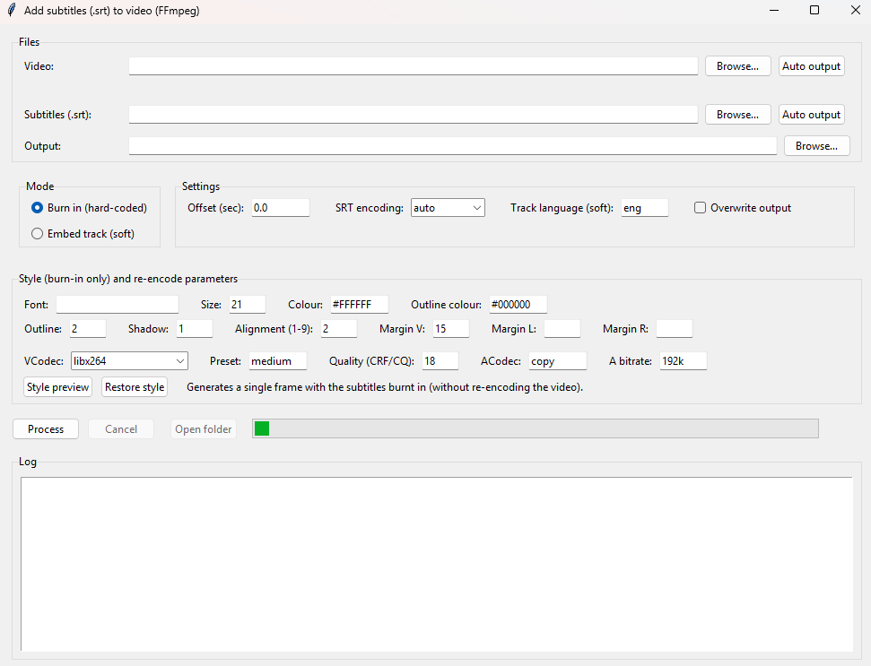
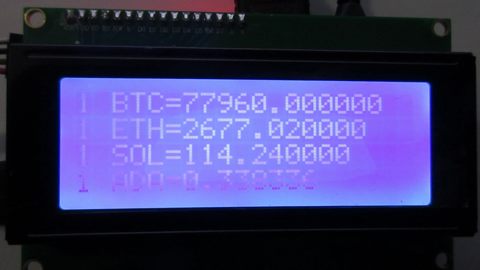
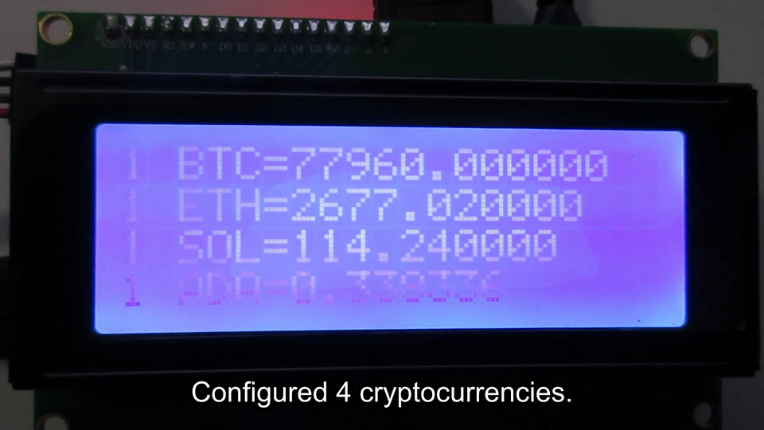

# addsubtitles

Desktop application (Tkinter GUI) for **adding `.srt` subtitles to a video** using FFmpeg. It offers two modes:

- **Burn in (hard-coded):** the subtitles are baked into the picture (re-encodes the video). Customisable: font, size, colour, outline, shadow, alignment and margins.
- **Embed track (soft):** adds the `.srt` as a selectable subtitle track, without re-encoding the video (fast).



## Example — how it works

The application takes a video plus an `.srt` and burns the subtitles into the picture. Below is the sample bundled in this repository ([`input.mp4`](input.mp4) + [`subtitles.srt`](subtitles.srt) → [`output.mp4`](output.mp4)), captured at the same instant (4.5 s):

<table>
<tr>
<th>Before — <code>input.mp4</code></th>
<th>After — <code>output.mp4</code></th>
</tr>
<tr>
<td></td>
<td></td>
</tr>
</table>

The line burnt in above (*"Configured 4 cryptocurrencies."*) is the first cue of [`subtitles.srt`](subtitles.srt):

```srt
1
00:00:00,000 --> 00:00:09,080
Configured 4 cryptocurrencies.

2
00:00:11,140 --> 00:00:27,110
java -jar cryptovalues.jar | ./parse_crypto_lcd.sh --priority "BTC,ETH,SOL,ADA" --invested 5500
```

### Play the sample videos

Animated preview — `output.mp4` as a 480×270 GIF (full clip, no audio), with both subtitles burnt in at the bottom:


For the full clip with audio: GitHub only plays inline videos that are uploaded as attachments, so the committed files are linked here for playback/download:

- ▶️ Input (no subtitles): [`input.mp4`](input.mp4)
- ▶️ Output (subtitles burnt in): [`output.mp4`](output.mp4)

## Requirements

- **Python 3.10+** (uses modern type annotations; standard library only, including `tkinter`).
- **FFmpeg** available on the `PATH`. Check that it works with:

  ```bash
  ffmpeg -version
  ```

  If you don't have it:
  - **Windows:** `winget install Gyan.FFmpeg` (or download it from [ffmpeg.org](https://ffmpeg.org/download.html) and add its `bin` folder to the PATH).
  - **macOS:** `brew install ffmpeg`
  - **Linux:** `sudo apt install ffmpeg` (or your distribution's package manager).

There are no Python dependencies to install (`pip`).

## Usage

```bash
python addsubtitles_gui.py
```

On Windows you can also use the launcher:

```bat
addsubtitles_gui.bat
```

Steps in the interface:

1. Select the **video** and the **`.srt`** (the **output** path is filled in automatically).
2. Choose the **mode** (Burn in or Embed track).
3. Adjust the options if you like (time offset, style, codecs…).
4. (Optional, Burn-in mode) Click **Style preview** to see a sample frame with the subtitles burnt in and tweak the font/colour/margins without re-encoding the whole video.
5. Click **Process**. You'll see the real progress (%) and the FFmpeg log.
6. When it finishes, use **Open folder** to see the result.

### Useful details

- **SRT encoding:** defaults to `auto` — detects a UTF-8/UTF-16 BOM and, if UTF-8 fails, uses `cp1252` (common in Windows-originated subtitles). You can also force it.
- **GPU acceleration (Burn-in mode):** the **VCodec** dropdown shows only the encoders your FFmpeg actually supports, including hardware ones: NVIDIA (`h264_nvenc`/`hevc_nvenc`), Intel Quick Sync (`*_qsv`), AMD (`*_amf`) and macOS (`*_videotoolbox`). Using the GPU greatly reduces encoding time on long videos. The **Quality (CRF/CQ)** value is automatically translated to the correct parameter for each encoder (`-crf`, `-cq`, `-global_quality`…).
- **Video info:** selecting a video shows its resolution, duration and fps (requires `ffprobe`, which ships with FFmpeg).
- **Last folder remembered:** the file dialogs open in the last folder you used.
- **Restore style:** button to return the subtitle style to its default values.
- **Offset (sec):** shifts the subtitle timings (e.g. `0.5` or `-1.2`) to sync them.
- **Remembered settings:** the options (mode, style, codecs, preset, CRF…) are saved between sessions in:
  - Windows: `%APPDATA%\addsubtitles_gui\settings.json`
  - Others: `~/addsubtitles_gui/settings.json`

## Development

The pure functions (time conversion, ASS colour, encoding detection, SRT shifting…) have unit tests that **require neither FFmpeg nor open the window**:

```bash
python -m unittest -v
```

## Structure

| File                    | Description                              |
| ----------------------- | ---------------------------------------- |
| `addsubtitles_gui.py`   | GUI application and FFmpeg logic.        |
| `addsubtitles_gui.bat`  | Windows launcher.                        |
| `test_addsubtitles.py`  | Unit tests for the pure functions.       |
